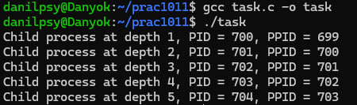

# ЗАВДАННЯ:

## Умова:

Реалізуйте послідовне породження процесів, де кожен створений процес створює ще один дочірній, усього п’ять разів. Прослідкуйте порядок завершення.

## [Код до завдання](task.c)

## Пояснення програми:

Програма створює послідовний ланцюг із п’яти процесів, де кожен новий дочірній процес сам створює ще одного. Для цього використовується цикл з викликом fork(), а змінна depth відслідковує глибину вкладеності. Після створення дитини, батьківський процес чекає її завершення через wait() і виходить. Таким чином, одночасно активним є лише один процес, що продовжує породження, поки не буде створено п’ять нащадків, кожен із яких має свій PID та PPID, які ми виводимо через printf для наглядності.

## Результат роботи:

