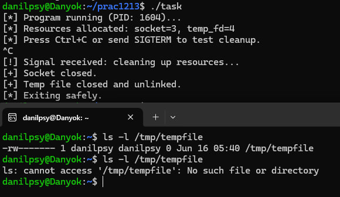

# ЗАВДАННЯ:

## Умова:

Реалізуйте сигналобезпечну функцію обробки помилки, яка намагається коректно завершити роботу з усіма ресурсами, включаючи сокети, тимчасові файли та потокові буфери.

## [Код до завдання](task.c)

## Пояснення програми:

Ця програма демонструє безпечну обробку аварійного завершення через сигнали (SIGINT, SIGTERM). Вона створює два ресурси — сокет і тимчасовий файл. При отриманні сигналу обробник safe_exit виконує очистку: закриває сокет, видаляє тимчасовий файл і завершує програму через _exit(), що є безпечним у контексті обробника сигналів. Таким чином, усі ресурси закриваються навіть у випадку примусового завершення. Обробник встановлюється за допомогою sigaction, що забезпечує надійність і контроль.

!!! Важливо розуміти, що виконувати логування в такому випадку через printf э некоректним через те що ця функція не є async-signal-safe, тому я знаходжу спосіб краще через write, але я всеж не став би цього робити в неучбовому випадку.

## Результат роботи:

На зображені я запускаю програму, після чого пробую перевірити існування тимчасового файлу, який створився в іншому терміналі, після чого я виконую примусову зупинку роботи і ми бачимо, що після цього вже файл не існує.