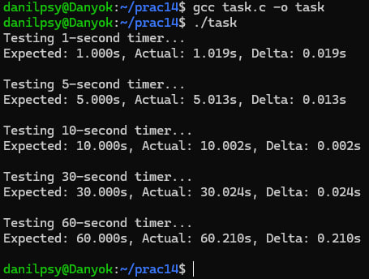
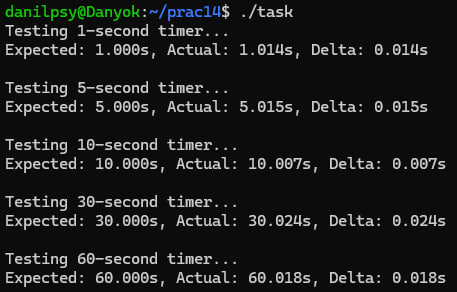
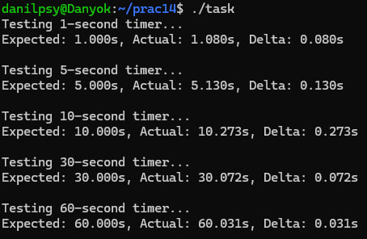

# ЗАВДАННЯ:

## Умова:

Напишіть тест, який перевіряє точність POSIX-таймера на великих інтервалах (від 1 до 60 секунд).

## [Код до завдання](task.c)

## Пояснення програми:

У цьому тесті перевіряється точність спрацьовування POSIX-таймера на великих інтервалах — від 1 до 60 секунд. Програма послідовно запускає таймер для кількох заданих інтервалів (1, 5, 10, 30, 60 секунд), і для кожного з них вимірює реальний час від моменту запуску до спрацювання. Для цього використовується clock_gettime() з монотонним годинником перед запуском таймера та в обробнику сигналу після його спрацювання. Результати виводяться у вигляді очікуваного часу, фактичного часу та дельти (відхилення), що дозволяє оцінити точність таймера. Такий підхід демонструє, наскільки надійно POSIX-таймери працюють на великих інтервалах, і чи зберігається їх точність у реальних умовах виконання.

## Результат роботи:

Під час "вимірювання" вікно терміналу було весь час активним і на компьютері виконувалися лише фонові процеси.

Цей тест я повторив ще декілька разів, тенденція не проявилася, іноді дельта була велика і на 60 секунд, і на 10 і навіть збільшувалася до 0.1 секунд у 5 секунд вимірі. 

