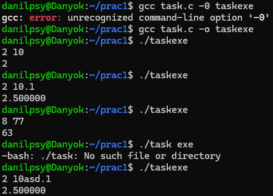

# Завдання(7 варіант)

## Умова:

Напишіть програму на ANSI C, яка читає з stdin довільне ціле число — основу системи числення, потім ціле число у цій системі числення, а далі виводить його значення у десятковій системі. Ігноруйте всі недопустимі символи.

Приклад:
Вхід:   8 77   
Вихід:  63 (значення 77 у системі числення з основою 8)

Додайте обробку значень із плаваючою точкою для десяткової системи числення.

## [Код до завдання](task.c)

## Як працює програма:

1. Користувач вводить основу та число.

2. Програма обробляє вхідні дані, ігноруючи некоректні символи.

3. Програма вираховує все в тому ж циклі де й зчитує число з циклу, це легко зробити тому що ми знаємо базу (2 101 -> маємо обще число наразі 0 * 2 + цифра в розряді 1 = 1, тепер 1 * 2 + 0 = 2, і в третій раз 2*2+1=5), логіка трохи змінюється коли ми переходимо через крапку. Таким чином це буде працювати навіть, якщо ми напишемо,наприклад, 2 0011 тому що загальне число буде лишатися 0 до першої валідної цифри.

4. Програма виводить значення числа у десятковій системі числення.

## Результат роботи для різних сценаріїв:

