# Завдання 1

## Умова:

1.	Напишіть програму для визначення моменту, коли time_t закінчиться.Дослідіть, які зміни відбуваються в залежності від 32- та 64-бітної архітектури. Дослідіть сегменти виконуваного файлу.

## [Код до завдання](task1/task1.c)

## Як працює програма:

1. Ми вручну формуємо максимальне позитивне значення time_t виходячи з його розміру. В 32 бітній системі воно переповнюється на 2038 році а 64 бітна буде мати занадто велике значення і виведе 0.
Також щоб компілювати 32 бітні програми мені довелося встановити бібліотеки, я встановив також і для с++.
sudo apt update
sudo apt install gcc-multilib g++-multilib libc6-dev-i386

## Результат роботи для різних сценаріїв:

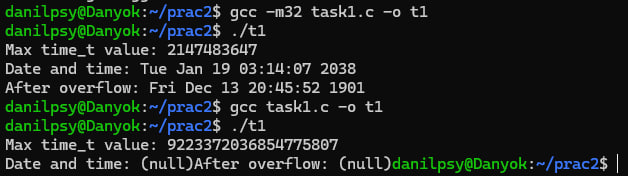

# Завдання 2

## Умова:

Розгляньте сегменти у виконуваному файлі.
1.	Скомпілюйте програму "hello world", запустіть ls -l для виконуваного файлу, щоб отримати його загальний розмір, і запустіть size, щоб отримати розміри сегментів всередині нього.
2.	Додайте оголошення глобального масиву із 1000 int, перекомпілюйте й повторіть вимірювання. Зверніть увагу на відмінності.
3.	Тепер додайте початкове значення в оголошення масиву (пам’ятайте, що C не змушує вас вказувати значення для кожного елемента масиву в ініціалізаторі). Це перемістить масив із сегмента BSS у сегмент даних. Повторіть вимірювання. Зверніть увагу на різницю.
4.	Тепер додайте оголошення великого масиву в локальну функцію. Оголосіть другий великий локальний масив з ініціалізатором. Повторіть вимірювання. Дані розташовуються всередині функцій, залишаючись у виконуваному файлі? Яка різниця, якщо масив ініціалізований чи ні?
5.	Які зміни відбуваються з розмірами файлів і сегментів, якщо ви компілюєте для налагодження? Для максимальної оптимізації?
Проаналізуйте результати, щоб переконатися, що:
●	сегмент даних зберігається у виконуваному файлі;
●	сегмент BSS не зберігається у виконуваному файлі (за винятком примітки щодо його вимог до розміру часу виконання);
●	текстовий сегмент більшою мірою піддається перевіркам оптимізації;
●	на розмір файлу a.out впливає компіляція для налагодження, але не сегменти.

## [Код крок 1](task2/task2_1.c)

## Результат кроку 1:

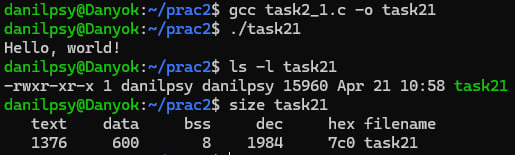

## [Код крок 2](task2/task2_2.c)

## Результат кроку 2:

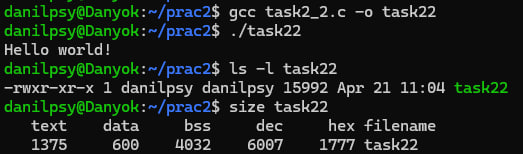

## [Код крок 3](task2/task2_3.c)

## Результат кроку 3:

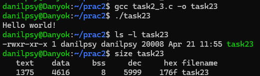

## [Код крок 4](task2/task2_4.c)

## Результат кроку 4:

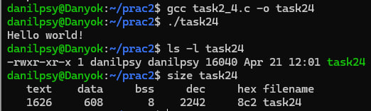

## Висновки:

Ініціалізований глобальний масив → сегмент даних.

Неініціалізований глобальний масив → BSS.

Локальні → стек (не відображаються у size).

Оптимізація -O3 зменшує текстовий сегмент.

-g збільшує розмір файлу, але не сегментів.

# Завдання 3

## Умова:

Скомпілюйте й запустіть тестову програму, щоб визначити приблизне розташування стека у вашій системі:

```c
#include <stdio.h>

int main() {
        int i;
        printf("The stack top is near %p\n";, &i);
        return 0;
}
```
Знайдіть розташування сегментів даних і тексту, а також купи всередині сегмента даних, оголосіть змінні, які будуть поміщені в ці сегменти, і виведіть їхні адреси.
Збільшіть розмір стека, викликавши функцію й оголосивши кілька великих локальних масивів. Яка зараз адреса вершини стека?
*Примітка*: стек може розташовуватися за різними адресами на різних архітектурах та різних ОС. Хоча ми говоримо про вершину стека, на більшості процесорів стек зростає вниз, до пам’яті з меншими значеннями адрес.

## [Код крок 1](task3/task3_1.c)

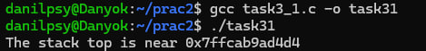

## [Код крок 2](task3/task3_2.c)

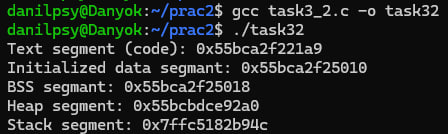

Ця програма демонструє розташування різних сегментів памʼяті: функція func виводить адреси коду (текстовий сегмент), глобальних змінних з ініціалізацією (x – сегмент даних) і без (y – BSS), динамічно виділеної памʼяті (heap) та локальної змінної (z – стек), що дозволяє наочно побачити, як операційна система розподіляє памʼять між цими сегментами.

## [Код крок 3](task3/task3_3.c)

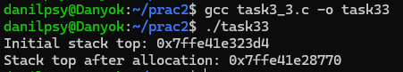

Показує, як змінюється розташування стеку після виділення великих локальних масивів: спочатку виводиться адреса змінної i в main як початкова вершина стеку, а потім у функції func створюються два великі масиви (arr1 і arr2), після чого виводиться адреса arr2, що дозволяє побачити, як стек розширюється вниз у памʼяті при виділенні великих обʼємів локальних даних.

# Завдання 4

## Умова:

Ваше завдання – дослідити стек процесу або пригадати, як це робиться. Ви можете:

● Автоматично за допомогою утиліти gstack.

● Вручну за допомогою налагоджувача GDB.

Користувачі Ubuntu можуть зіткнутися з проблемою: на момент написання (Ubuntu 18.04) gstack, схоже, не був доступний (альтернативою може бути pstack). Якщо gstack не працює, використовуйте другий метод – через GDB, як показано нижче. Спочатку подивіться на стек за допомогою gstack(1). Нижче наведений приклад стека bash (аргументом команди є PID процесу):
$ gstack 14654
#0 0x00007f359ec7ee7a in waitpid () from /lib64/libc.so.6
#1 0x000056474b4b41d9 in waitchild.isra ()
#2 0x000056474b4b595d in wait_for ()
#3 0x000056474b4a5033 in execute_command_internal ()
#4 0x000056474b4a5c22 in execute_command ()
#5 0x000056474b48f252 in reader_loop ()
#6 0x000056474b48dd32 in main ()
$
Розбір стека:
    ● Номер кадру стека відображається ліворуч перед символом #.

    ● Кадр #0 – це найнижчий кадр. Читайте стек знизу вверх (тобто від main() – кадр #6 – до waitpid() – кадр #0).

    ● Якщо процес багатопотоковий, gstack покаже стек кожного потоку окремо.

Аналіз стека в режимі користувача через GDB

Щоб переглянути стек процесу вручну, використовуйте GDB, приєднавшись до процесу. Нижче наведена невелика тестова програма на C, що виконує кілька вкладених викликів функцій. Граф викликів виглядає так:

    main() --&gt; foo() --&gt; bar() --&gt; bar_is_now_closed() --&gt; pause()

Системний виклик pause() – це приклад блокуючого виклику. Він переводить викликаючий процес у сплячий режим, очікуючи (або блокуючи) сигнал. У цьому випадку процес блокується, поки не отримає будь-який сигнал.

```c
#include <stdio.h>
#include <stdlib.h>
#include <unistd.h>
#include <sys/types.h>

#define MSG &quot;In function %20s; &amp;localvar = %p\n&quot;

static void bar_is_now_closed(void) {
    int localvar = 5;
    printf(MSG, FUNCTION, &localvar);
    printf("\n Now blocking on pause()...\n");

    pause();
}

static void bar(void) {
    int localvar = 5;
    printf(MSG, FUNCTION, &localvar);
    bar_is_now_closed();
}

static void foo(void) {
    int localvar = 5;
    printf(MSG, FUNCTION, &localvar);
    bar();
}

int main(int argc, char **argv) {
    int localvar = 5;
    printf(MSG, FUNCTION, &localvar);
    foo();
    exit(EXIT_SUCCESS);
}
```

## [Код завдання](task4/task4.c)

Програма має вкладені виклики функцій із передачею керування через main(), foo(), bar() та bar_is_now_closed() і далі блокується викликом pause(). Кожна функція виводить адресу своєї локальної змінної, дозволяючи відстежувати зміни в стеку. По завданню, ми відкриваємо інший термінал та ловимо процесс за допомогою gdb та дослідити стек.

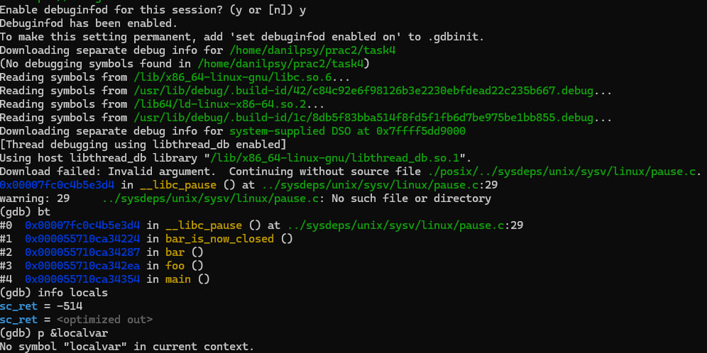

# Завдання 5

## Умова:

Відомо, що при виклику процедур і поверненні з них процесор використовує стек.Чи можна в такій схемі обійтися без лічильника команд (IP), використовуючи замість нього вершину стека? Обґрунтуйте свою відповідь та наведіть приклади.

Ні, IP (instruction pointer) неможливо замінити стеком. Стек зберігає лише адреси повернення, але не керує самостійно потоком команд. Без IP процесор не знатиме, яку інструкцію виконувати далі.

## [Код завдання](task5/task5.c)

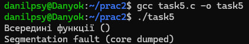

У другій по черзі визову функції проводиться зміна вершини стеку без оновлення IP, що приводить до небажаного закінчення програми.

# Завдання (Варіант 7)

## Умова:

Створіть програму, що змінює права доступу до сегментів пам’яті (mprotect).

## [Код до завдання](task6/task6.c)

Я визначаю розмір сторінки за допомогою sysconf(_SC_PAGESIZE);. Далі я створюю сторінку пам'яті в яку можна і читати і записувати, що ми і робимо, але потім я змінюю права доступу за допомогою mprotect, роблячи сторінку тільки для читання. Після спроби записати в неї дещо, програма закінчується помилкою.

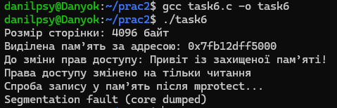