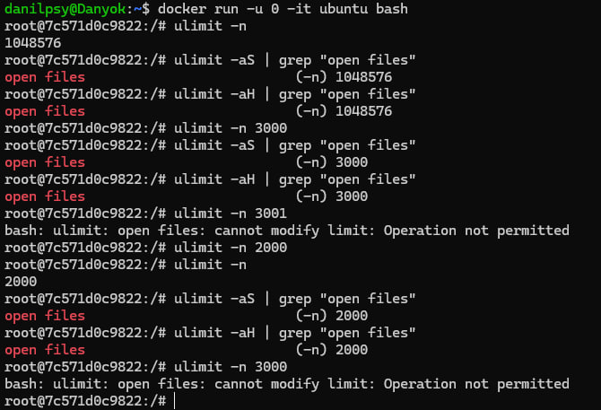

# ЗАВДАННЯ 1:

## Умова:

Запустіть Docker-контейнер і поекспериментуйте з максимальним лімітом ресурсів відкритих файлів. Для цього виконайте команди у вказаному порядку:

$ ulimit -n

$ ulimit -aS | grep "open files"

$ ulimit -aH | grep "open files"

$ ulimit -n 3000

$ ulimit -aS | grep "open files"

$ ulimit -aH | grep "open files"

$ ulimit -n 3001

$ ulimit -n 2000

$ ulimit -n

$ ulimit -aS | grep "open files"

$ ulimit -aH | grep "open files"

$ ulimit -n 3000

Як наступне вправу, повторіть перераховані команди з root-правами.

## Виконання:

Для виконання цього завдання було встановлено Ubuntu Server з Docker-ом на Virtual Box. Далі запускаємо контейнер і вводимо команди з умови:

```bash
docker run -it --rm ubuntu bash
```


Як результат отримуємо, що змінювати ліміти ми можемо лише вниз. Для підвищення не вистачає прав.

Після цього виходимо з контейнера та запускаємо його повторно, але з параметром `--privileged`, щоб отримати root-права.

```bash
docker run -it --rm --privileged ubuntu bash
```



І як результат, за допомогою root-прав можемо як понижувати так і підвищувати ліміти.


# ЗАВДАННЯ 2:

## Умова:

У Docker-контейнері встановіть утиліту `perf(1)`. Поекспериментуйте з досягненням процесом встановленого ліміту.

## Виконання:

Для початку запускаємо контейнер та встановлюємо `perf` за допомогою 
```bash
apt update && apt install -y linux-tools-common linux-tools-generic linux-tools-$(uname -r)
```

Після цього перевіряємо встановлення `perf` за допомогою `perf --version` та встановлюємо ліміт на кількість запущених процесів:


**Примітка:** 

*Пізніше, дослідницьким шляхом, було з'ясвоно, що встановлення лімітів за допомогою команди `ulimit -u` впливає на кількість запущених процесів користувачем, а не системою загалом, тож дана команда виявиться марною.*

Далі за допомогою команди `nano test.sh` створюємо та редагуємо скрипт:

### [Код скрипта](task2/task2.sh)

Після збереження файлу, запускаємо його за допомогою `nohup ./test.sh &`. `./test.sh` запускає сам скрипт, `&` - робить запуск фоновим, а `nohup` ігнорує ввід та перенаправляє вивід скрипта у файл `nohup.out` замість виводу в `bash`.


Після цього запускаємо
```bash
perf top -p $(pgrep -d',' -f test.sh)
```
для того, щоб побачити скільки ресурсів займає скрипт `test.sh`. `perf top` відображає всі активні процес та скільки ресурсів займає кожен з них наживо, `-p` фільтрує вивід за конкретним процесом, а `pgrep -d',' -f test.sh` знаходить всі процеси, що мають `test.sh` в імені та виводить їх PID.


Додатково можна запустити

```bash
ps aux | grep test.sh
```

щоб побачити процеси, які відповідають `test.sh` та їх PID.


# ЗАВДАННЯ 3:

## Умова:

Напишіть програму, що імітує кидання шестигранного кубика. Імітуйте кидки, результати записуйте у файл, для якого попередньо встановлено обмеження на його максимальний розмір (max file size). Коректно обробіть ситуацію перевищення ліміту.

## [Код до завдання](task3/task3.c)

## Виконання:

Для початку запустимо контейнер та встановимо `gcc` та `nano` за допомогою команд
```bash
apt update 
apt install gcc && apt install nano
```

та перевіримо встановлення за допомогою `--version`


Далі скомпілюємо та запустимо програму. Після запуску програма починає імітувати кидання кубика та записувати дані у файл `results.txt` поки користувач не зупинить програму за допомогою Ctrl + C або поки файл не заповниться. Якщо файл заповниться буде запропоновано очистити його або зупинити програму.


Можемо також переглянути вміст файлу `results.txt` за допомогою команди `cat results.txt`


та перевірити розмір файлу за допомогою `ls -lh results.txt` 


**Примітка:**
*"Rolling:" займає 8 байтів, пробіл після двокрапки та цифра займають 2 байти і ще один байт займає символ нового рядка. В результаті 99 байтів займає файл (11 байтів на рядок і 9 рядків).*


# ЗАВДАННЯ 4:

## Умова:

Напишіть програму, що імітує лотерею, вибираючи 7 різних цілих чисел у діапазоні від 1 до 49 і ще 6 з 36. Встановіть обмеження на час ЦП (max CPU time) і генеруйте результати вибору чисел (7 із 49, 6 із 36). Обробіть ситуацію, коли ліміт ресурсу вичерпано.

## [Код до завдання](task4/task4.c)

## Виконня:

Для початку запустимо docker та встановимо `gcc` та `nano` для написання програми, яка імітує лотерею, вибираючи випадкові числа у двох наборах: 7 чисел із діапазону від 1 до 49 і 6 чисел із діапазону від 1 до 36. Для цього використовується алгоритм перемішування масиву чисел, з якого беруться перші N елементів (де N – кількість необхідних чисел). Генерація чисел здійснюється за допомогою вбудованого генератора випадкових чисел, ініціалізованого поточним часом. Перед початком роботи програми встановлюється ліміт часу використання процесора за допомогою функції `setrlimit` із параметром `RLIMIT_CPU`. У цьому коді максимальний ліміт часу процесора встановлений на 2 секунди. Якщо програма перевищує цей ліміт, система автоматично завершує її виконання. Спочатку програма генерує 7 чисел із діапазону 1–49, потім 6 чисел із діапазону 1–36. Результати кожного набору чисел виводяться на екран. Якщо програма завершує свою роботу без перевищення ліміту процесора, користувач бачить повідомлення про успішне завершення генерації лотереї. У разі перевищення ліміту програма примусово завершується операційною системою, і користувач отримає системне повідомлення про завершення.


# ЗАВДАННЯ 5:

## Умова:

Напишіть програму для копіювання одного іменованого файлу в інший. Імена файлів передаються у вигляді аргументів.
Програма має:
- перевіряти, чи передано два аргументи, інакше виводити "Program need two arguments";

- перевіряти доступність першого файлу для читання, інакше виводити "Cannot open file .... for reading";

- перевіряти доступність другого файлу для запису, інакше виводити "Cannot open file .... for writing";

- обробляти ситуацію перевищення обмеження на розмір файлу.


## [Код до завдання](task5/task5.c)

## Виконня:

Програма приймає два аргументи: ім'я вхідного файлу (джерела) і ім'я вихідного файлу (призначення). Якщо кількість аргументів неправильна, програма завершує роботу з повідомленням: "Program need two arguments". Спочатку програма намагається відкрити вхідний файл для читання. Якщо файл недоступний, вона виводить повідомлення: "Cannot open file [ім'я_файлу] for reading" і завершує роботу. Потім вона намагається відкрити вихідний файл для запису. Якщо файл неможливо відкрити для запису, програма виводить повідомлення: "Cannot open file [ім'я_файлу] for writing" і також завершує роботу. Далі починається процес копіювання. Дані зчитуються з вхідного файлу блоками фіксованого розміру (1024 байти) і записуються у вихідний файл. Під час кожного запису програма перевіряє, чи не перевищено встановлений ліміт розміру файлу (1 MB). Якщо загальний розмір вихідного файлу перевищує цей ліміт, програма виводить повідомлення: "Error: File size limit exceeded while writing to [ім'я_файлу]" і завершує роботу. Якщо весь процес копіювання завершується успішно, програма виводить повідомлення: "File successfully copied from [вхідний_файл] to [вихідний_файл]".


Вміст файлі `source.txt` та `destination.txt`:


# ЗАВДАННЯ 6:

## Умова:

Напишіть програму, що демонструє використання обмеження (`max stack segment size`). Підказка: рекурсивна програма активно використовує стек.

## [Код до завдання](task6/task6.c)

## Виконання

Ця програма має рекурсивну функцію для перевірки `max stack segment size`. Перед запуском доречно встановити ліміт на сегмент стека за допомогою

```bash
ulimit -s 256
```


Після досягнення ліміту отримуємо `Segmentation fault (core dumped)`


# ЗАВДАННЯ ПО ВАРІАНТАХ (7 ВАРІАНТ):

## Умова:

Використати ulimit -v для обмеження використання резидентної пам’яті.

## [Код до завдання](task7/task7.c)

## Виконання:

Програма намагається виділити 100 МБ пам'яті за допомогою функції `malloc`. Потім вона заповнює цей масив нулями, щоб гарантовано використовувати всю пам'ять. Якщо пам'ять виділена успішно, програма чекає на натискання `Enter` перед звільненням пам'яті і завершенням виконання.

Команда ulimit -v встановлює ліміт на максимальний обсяг віртуальної пам'яті, яку може використовувати процес. Це обмеження визначає, скільки пам'яті може виділити процес для своїх потреб, включаючи як резидентну пам'ять (яка фактично перебуває в ОЗП), так і віртуальну пам'ять, яку процес може вимагати (наприклад, при алокаціях через malloc, файли підкачки тощо). Встановимо ліміт на використання 100 МБ (`ulimit -v 102400`) пам'яті для програми та запустимо її:


Як і очікувалось ми отримуємо помилку, тому що програма намагється виділити 100 МБ пам'яті, але для виконання самої програми також потрібна деяка кількість пам'яті через що, ліміт в 100 МБ перевищується і ми отримуємо помилку. Далі трохи збільшимо ліміт на максимальний обсяг віртуальної пам'яті і спробуємо запустити ще раз:


