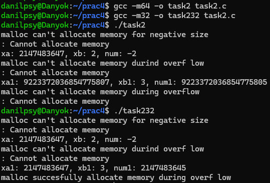
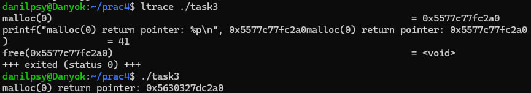
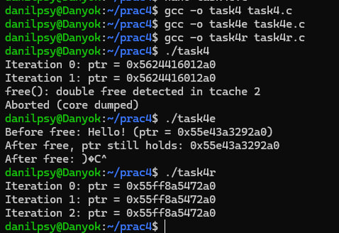
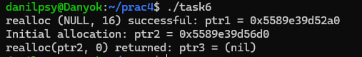
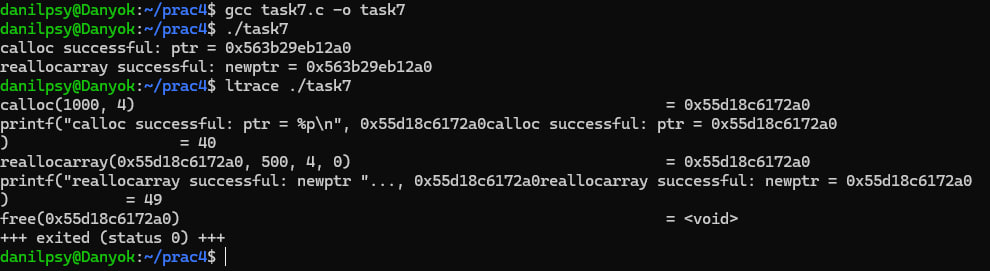
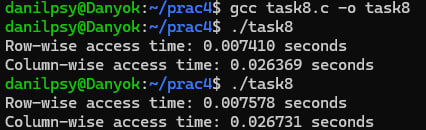
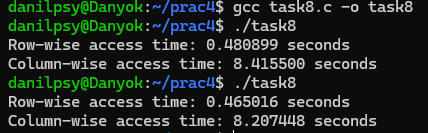

# ЗАВДАННЯ 1:

## Умова:

Скільки пам’яті може виділити `malloc(3)` за один виклик? Параметр `malloc(3)` є цілим числом типу даних `size_t`, тому логічно максимальне число, яке можна передати як параметр `malloc(3)`, — це максимальне значення size_t на платформі (`sizeof(size_t)`). У 64-бітній Linux `size_t` становить 8 байтів, тобто 8 * 8 = 64 біти. Відповідно, максимальний обсяг пам’яті, який може бути виділений за один виклик `malloc(3)`, дорівнює 2^64. Спробуйте запустити код на x86_64 та x86. Чому теоретично максимальний обсяг складає 8 ексабайт, а не 16?

## Пояснення:

Теоретично size_t на 64 бітах може зберігати числа до 2^64−1, тобто майже 16 ексабайт.
Але фізично адресація пам'яті у 64-бітних процесорах обмежена — наприклад, на x86_64 реально використовується лише 48 або 57 біт адресного простору, а не повних 64 біти.
Тому реальна межа — близько 256 ТБ або трохи більше, а не 16 ЕБ.


# ЗАВДАННЯ 2:

## Умова:

Що станеться, якщо передати malloc(3) від’ємний аргумент? Напишіть тестовий випадок, який обчислює кількість виділених байтів за формулою num = xa * xb. Що буде, якщо num оголошене як цілочисельна змінна зі знаком, а результат множення призведе до переповнення? Як себе поведе malloc(3)? Запустіть програму на x86_64 і x86.

## [Код до завдання](task2/task2.c)

## Пояснення програми:

У цій програмі тестується поведінка `malloc()` при передачі від’ємного значення та при переповненні при множенні двох цілих чисел. Перший тест перевіряє, що станеться, якщо передати -1 як аргумент для `malloc()`. Як видно з результатів, `malloc()` не може виділити пам’ять і повертає `NULL`, що очікувано, оскільки параметр повинен бути беззнаковим числом. Далі програма тестує ситуацію, коли результат множення двох цілих чисел зі знаком викликає переповнення. Від’ємне значення `num` після множення `xa` та `xb` свідчить про переповнення, і спроба виділення такого обсягу пам’яті також завершується помилкою. Аналогічний тест проводиться з беззнаковими змінними, і в 32-бітній системі також виникає переповнення, яке спричиняє помилку при виділенні пам’яті.

## Результат роботи:




# ЗАВДАННЯ 3:

## Умова:

Що станеться, якщо використати malloc(0)? Напишіть тестовий випадок, у якому malloc(3) повертає NULL або вказівник, що не є NULL, і який можна передати у free(). Відкомпілюйте та запустіть через ltrace. Поясніть поведінку програми.

## [Код до завдання](task3/task3.c)

## Пояснення програми:

Ця програма досліджує поведінку `malloc(0)`. Поведінка `malloc(0)` залежить від реалізації, він може повернути `NULL` або ненульовий вказівник, який можна передати `free()`. У результатах роботи програми видно, що `malloc(0)` повернув певний вказівник, який можна було звільнити за допомогою `free()`, що підтверджує можливу поведінку цього виклику.

## Результат роботи:




# ЗАВДАННЯ 4:

## Умова:

Чи є помилки у такому коді?
```c
void *ptr = NULL;
while (<some-condition-is-true>) {
    if (!ptr)
        ptr = malloc(n);
    [... <використання 'ptr'> ...]
    free(ptr);
}
```

Напишіть тестовий випадок, який продемонструє проблему та правильний варіант коду.

## Коди до задачі:

### [Початковий код](task4/task4.c)

### [Приклад проблеми](task4/task4e.c)

### [Правильний варіант коду](task4/task4r.c)

## Пояснення програми:

Ця програма демонструє проблему використання вказівника після його звільнення. У початковому варіанті коду після `free()` вказівник `ptr` не оновлюється, тому в наступній ітерації він може залишатися невизначеним, що може спричинити використання звільненої пам’яті. У тестовому прикладі показано, як вказівник все ще містить старі дані після виклику `free()`, що є потенційною помилкою. Правильний варіант коду вирішує проблему, встановлюючи `ptr` у `NULL` після виклику `free()`, що унеможливлює повторне використання звільненої пам’яті.

## Результат роботи:




# ЗАВДАННЯ 5:

## Умова:

Що станеться, якщо realloc(3) не зможе виділити пам’ять? Напишіть тестовий випадок, що демонструє цей сценарій.

## [Код до завдання](task5/task5.c)

## Пояснення програми:

Ми виділяємо спочатку 10 байт. Потім намагаємося змінити розмір до SIZE_MAX (максимальний розмір типу size_t), що майже завжди призведе до помилки виділення. realloc() поверне NULL, але старий ptr все ще валідний — його потрібно вручну звільнити через free(ptr).

## Результат роботи:


# ЗАВДАННЯ 6:

## Умова:

Якщо realloc(3) викликати з NULL або розміром 0, що станеться? Напишіть тестовий випадок.

## [Код до завдання](task6/task6.c)

## Пояснення програми:

Ця програма тестує два випадки використання `realloc`:

- Якщо `realloc(NULL, size)` викликається, він працює так само, як `malloc(size)`, тобто виділяє новий блок пам’яті.

- Якщо `realloc(ptr, 0)` викликається, зазвичай він або повертає `NULL`, або діє так само, як `free(ptr)`.

Перше повідомлення свідчить про те, що `realloc(NULL, 16)` виділив нову область пам’яті за адресою `0x3b60f9209000`, тобто працював аналогічно `malloc(16)`. Далі `ptr2` був успішно виділений через `malloc(32)`, отримавши адресу `0x3b60f9214000`. Останній рядок показує, що `realloc(ptr2, 0)` повернув нову адресу nil, це означає в моэму середовищі realloc лише звільняє пам’ять і не надає нової адреси.

## Результат роботи:




# ЗАВДАННЯ 7:

## Умова:

Перепишіть наступний код, використовуючи reallocarray(3):
```c
struct sbar *ptr, *newptr;
ptr = calloc(1000, sizeof(struct sbar));
newptr = realloc(ptr, 500*sizeof(struct sbar));
```

Порівняйте результати виконання з використанням ltrace.

## [Код до завдання](task7/task7.c)

## Пояснення програми:

Тут потрібно переписати код із використанням `reallocarray(3)`, який працює аналогічно `realloc`, але безпечно обчислює розмір виділеної пам’яті, запобігаючи переповненню. Спочатку `calloc(1000, sizeof(struct sbar))` успішно виділяє область пам’яті, про що свідчить повідомлення `calloc successful: ptr = 0x205518609000`. Потім виконується `reallocarray(ptr, 500, sizeof(struct sbar))`, який зменшує розмір області, і повертається новий вказівник `0x205518613000`. Вивід `ltrace` показує, що спочатку виконується `calloc(1000, 4)`, потім `reallocarray(0x204f49009000, 500, 4)`, і новий вказівник успішно змінюється. Це підтверджує, що `reallocarray` коректно переобчислює розмір і працює так само, як `realloc`, але із додатковою безпекою від переповнення.

## Результат роботи:




# ЗАВДАННЯ ПО ВАРІАНТАХ (7 ВАРІАНТ):

## Умова:

Напишіть програму, яка перевіряє ефективність cache locality для розподіленої пам’яті.

## [Код до завдання](task8/task8.c)

## Пояснення програми:

Програма тестує ефективність доступу до пам’яті при построковому та постовпчиковому обході. В результатах виконання:

- Для `SIZE = 1024` час доступу по рядках та по стовпцях приблизно однаковий.

- Для `SIZE = 8192` построчний доступ займає ~1.3 секунди, тоді як постовпчиковий — понад 8 секунд.

Це відбувається через кешування пам’яті: процесор кешує дані по рядках, тому построчний доступ є значно ефективнішим. При проходженні по стовпцях доступ до пам’яті відбувається не послідовно, що призводить до частих кеш-промахів і значного сповільнення виконання.

## Результат роботи:

*`#def int SIZE 1024`*



*`#def int SIZE 8192`*


