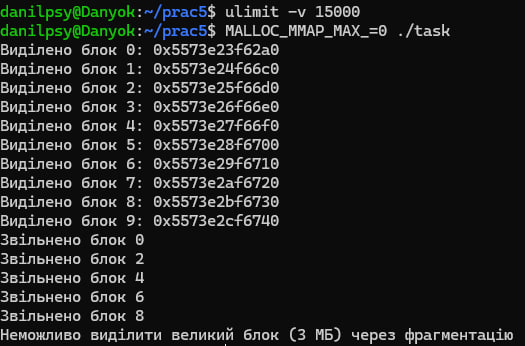
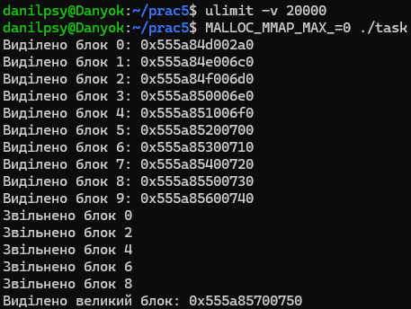
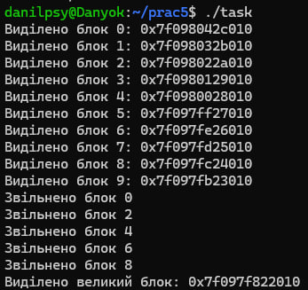

# ЗАВДАННЯ:

## Умова:

Створіть випадок, коли фрагментація heap-пам’яті стає причиною відмови виділення нового блоку, навіть якщо загалом пам’яті ще вистачає.

## [Код до завдання](task.c)

## Пояснення програми:

Виділяється 10 блоків по 1 МБ. Звільняються тільки парні (0, 2, 4, 6, 8). Пам’ять стала фрагментованою — є 5 вільних блоків по 1 МБ, але немає 3 послідовних МБ. malloc(3 * 1 МБ) зазнає невдачі, хоч сумарно вільно 5 МБ.

В нормі великі аллокації (наприклад, >128 КБ) виділяються через mmap(), а не через основний heap (brk). Через це є проблема, тому що mmap() не страждає від фрагментації — кожен блок виділяється окремо, тому фрагментацію важко відтворити. MALLOC_MMAP_MAX_=0 відключає використання mmap() для malloc(). Таким чином всі виділення тепер йдуть через heap (brk), де пам’ять послідовна, і фрагментація справді проявляється. Також, я додатково обмежую пам’ять до 15 мб. Таким чином в нас проявляється проблема навіть з умовою що в кінці ми маємо ще більше ніж наші теоретичні 5 вільних МБ.

## Результат роботи:

