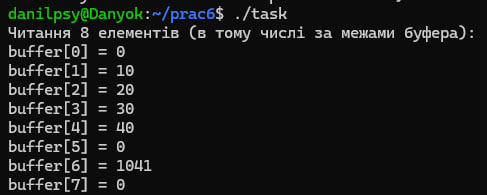
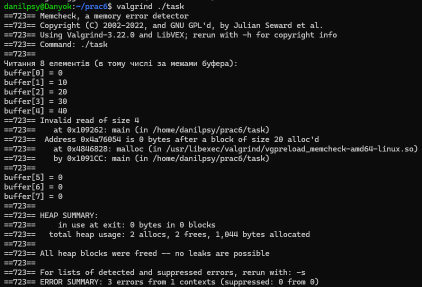
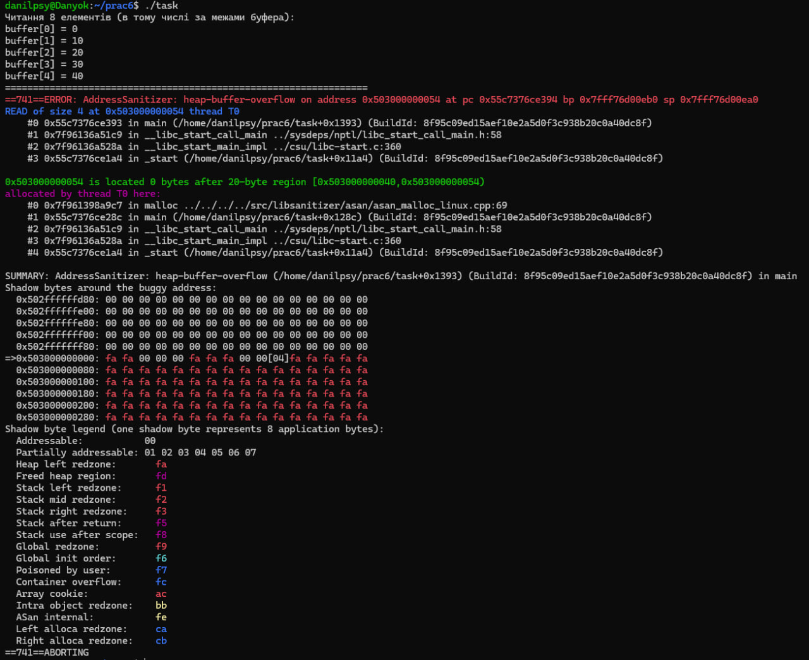
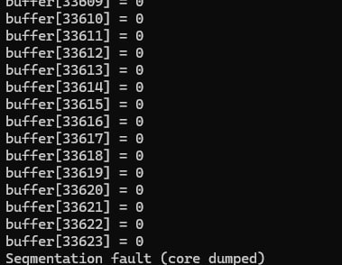

# ЗАВДАННЯ:

## Умова:

Test Case #6: реалізуйте переповнення при читанні в динамічному масиві (malloc).

## [Код до завдання](task.c)

## Пояснення програми:

Ми виділяємо пам’ять для 5 int. Ініціалізуємо ці 5 елементів. Але потім намагаємось прочитати 8 елементів, включаючи 3 поза межами. Це переповнення при читанні, яке може призвести до: Читання сміттєвих значень, Segmentation fault.

Далі пояснення буде за випадками.

## Результат роботи випадків:

Звичайний приклад видає лише читання сміттєвих значень, які знаходилися близько в пам’яті. Це виходить через те, що читання не таке небезпечне і ми виконували звичайну компіляцію.

Приклад з командою valgrind, звичайний інструмент для налагоджування, який в нашому випадку дає можливість знайти помилки з пам'ятю.

Приклад компіляції з gcc -fsanitize=address, це інструмент вбудованої діагностики помилок роботи з пам’яттю при компіляції в gcc. 

Приклад виклику помилки через просте читання, без ніяких команд. В цьому разі ми просто читаємо занадто далеко і знаходимо невдале значення в пам'яті. 

